## Introduction

This presentation will provide a short introduction to different ways of visualizing a genomics dataset:

Dimensionality reductions (projections)

- PCA
- LDA and PLSDA
- MDS

Heatmap like:

- Correlograms
- Heatmaps with prior k-means clustering.

Clusterings:

- Agglomerative
- Divisive

## Setup

Packages:

```r
library(ABC2017)
library(ggplot2)
theme_set(theme_bw())
library(RColorBrewer)
library(pheatmap)
library(edgeR)
```

```
## Loading required package: limma
```

```r
data(zebrafish)
```

## Setup

We start from the trimmed and normalized EM from before:

```r
# Trim
above_one <- rowSums(zebrafish$Expression > 1)
trimmed_em <- subset(zebrafish$Expression, above_one > 3)

# Normalize
dge <- DGEList(trimmed_em)
dge <- calcNormFactors(object=dge, method="TMM")
EM <- cpm(x=dge, log=TRUE)
```

# Principal Components Anaysis (PCA)

## PCA

You already know PCA from BoHTA. PCA decomposes the (scaled) EM into principle components representing orthogonal rotations that maximizes total variance. 

This is a powerful way of visualizing data since it will highlight the major but mutually exclusive patterns, as well as quantifiying the contribution of each pattern to the total through explained variance of the components.

PCA in R is simple (Recap from BoHTA): 

```r
# Perfrom PCA
pca <- prcomp(x=t(EM), scale=TRUE, center=TRUE)

# Inspect components
summary(pca)
```

```
## Importance of components%s:
##                            PC1     PC2     PC3     PC4     PC5       PC6
## Standard deviation     82.4185 66.7112 57.2301 53.4794 48.8824 2.234e-13
## Proportion of Variance  0.3436  0.2251  0.1657  0.1447  0.1209 0.000e+00
## Cumulative Proportion   0.3436  0.5688  0.7344  0.8791  1.0000 1.000e+00
```

## PCA


```r
qplot(data=as.data.frame(pca$x), x=PC1, y=PC2, geom=c("text"), 
			color=zebrafish$Design$gallein, label=rownames(zebrafish$Design))
```

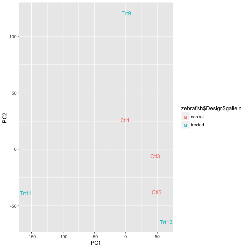

## PCA


```r
qplot(data=as.data.frame(pca$x), x=PC1, y=PC3, geom=c("text"), 
			color=zebrafish$Design$gallein, label=rownames(zebrafish$Design))
```


# Heatmaps

## Aim

Heatmaps are classic way of visulizaing datasets as a clustered matrix with color-reprensentation of magnitude.

In addition to visualization of the EM, it also features row and column wise hierachical clusterings, and can be further annotated with groupings along the margins.

Heatmaps are normally most useful for small dataset, otherwise rows, columns and trees tend to get smeared.

A way to get around this is to group genes prior to plotting, which allows for plotting of much bigger data but loosing resolution of individual features.

## Heatmap of large datasets

```r
pheatmap::pheatmap(mat=EM, annotation_col=zebrafish$Design, scale="row")
# Running this takes waaaaay to long!
```

## Heatmap of large datasets

```r
pheatmap::pheatmap(mat = EM, kmeans_k = 10, annotation_col = zebrafish$Design, 
    scale = "row")
```

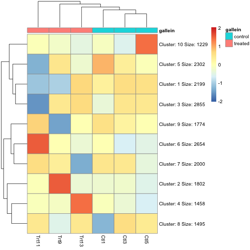

## Heatmap of large datasets

```r
pheatmap::pheatmap(mat = EM, kmeans_k = 100, annotation_col = zebrafish$Design, 
    scale = "row")
```

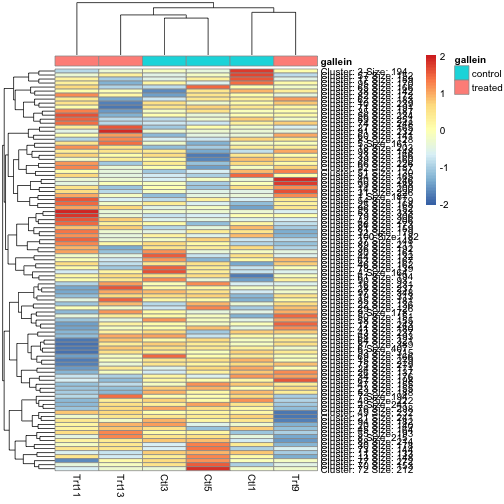

## Heatmap of large datasets

```r
pheatmap::pheatmap(mat = EM, kmeans_k = 1000, annotation_col = zebrafish$Design, 
    scale = "row")
```

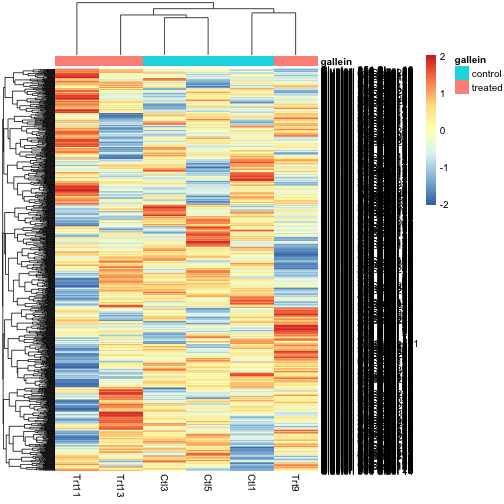

# Distance matrices

## Aim

In many cases we are not (yet) interested in individual genes or clusters, but only on how the samples are different.

A simple way a quantifiying this is to calculate the distance (i.e. euclidian distance) between samples, and plot these values in a heatmap.

Following is examples of doing this. Let's first define the distances:

```r
# Transpose for samples-wise distances
distmat <- dist(t(EM)) #
```

## Heatmap of distance matrix

```r
pheatmap::pheatmap(mat = as.matrix(distmat), color = brewer.pal(name = "RdPu", 
    n = 9), clustering_distance_rows = distmat, clustering_distance_cols = distmat, 
    annotation_col = zebrafish$Design, annotation_row = zebrafish$Design)
```


# Multi-Dimensional Scaling (MDS)

## Aim

We can view the distance matrix as a new high-dimensional space, where measurements are now distances to other samples.

This means we can use dimensionality reduction to try an represent the distance matrix in fewer dimensions!

Multi-Dimensional Scaling finds a low-dimensional representation (usually 2D) of a high-dimensional distance matrix, preserving the distances between samples as best as possible.

Let's see how this works first by using the example data `UScitiesD`!

## MDS: Small example

The UScitiesD is `dist` object holding distances between 9 major US cities:


```r
class(UScitiesD)
```

```
## [1] "dist"
```

```r
UScitiesD
```

```
##               Atlanta Chicago Denver Houston LosAngeles Miami NewYork
## Chicago           587                                                
## Denver           1212     920                                        
## Houston           701     940    879                                 
## LosAngeles       1936    1745    831    1374                         
## Miami             604    1188   1726     968       2339              
## NewYork           748     713   1631    1420       2451  1092        
## SanFrancisco     2139    1858    949    1645        347  2594    2571
## Seattle          2182    1737   1021    1891        959  2734    2408
## Washington.DC     543     597   1494    1220       2300   923     205
##               SanFrancisco Seattle
## Chicago                           
## Denver                            
## Houston                           
## LosAngeles                        
## Miami                             
## NewYork                           
## SanFrancisco                      
## Seattle                678        
## Washington.DC         2442    2329
```

## MDS: Small example

We can use `cmdscale` function to reduce the dimensionality of the distance matrix:


```r
# Call cmdscale
mds <- cmdscale(UScitiesD, k = 2)
mds
```

```
##                     [,1]       [,2]
## Atlanta        -718.7594  142.99427
## Chicago        -382.0558 -340.83962
## Denver          481.6023  -25.28504
## Houston        -161.4663  572.76991
## LosAngeles     1203.7380  390.10029
## Miami         -1133.5271  581.90731
## NewYork       -1072.2357 -519.02423
## SanFrancisco   1420.6033  112.58920
## Seattle        1341.7225 -579.73928
## Washington.DC  -979.6220 -335.47281
```

We can then easily plot this 2D representation: How does it look?

## MDS: Small example


```r
qplot(x = mds[, 1], y = mds[, 2], label = rownames(mds), geom = "text")
```

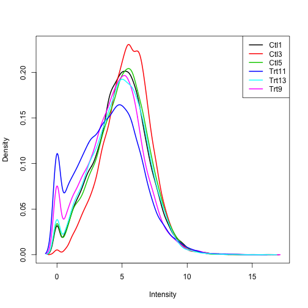

## MDS: Real example

Let's use the distance matrix from before and do MDS:


```r
mds <- cmdscale(distmat, k = 2)
```

Gather all the info we need for plotting:

```r
P <- data.frame(zebrafish$Design, mds)
```

How does the plot look compared to the PCA-plot?

## MDS: Real example


```r
qplot(x = X1, y = X2, label = rownames(P), color = gallein, geom = "text", data = P)
```

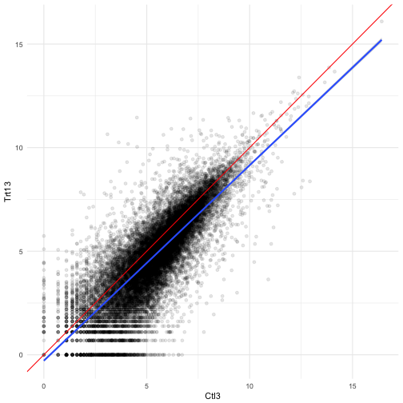

## MDS: edgeR and limma

One of the advantages of MDS is that the distance matrix can be calculated in any way possible. While it might not always be possible to do PCA (i.e. missing values), it is usually possible to define some distance measure between samples.

MDS is the built-in visualization method in edgeR (and limma), where distances are calculated in a different way:

Instead of calculating distance based on all genes, it only used topN features: Either defined by overall differences or pairwise differences.

This goes back to the assumption that most genes are not changing, and therefore there's little to gain in including them in the analysis.

## MDS: edgeR and limma

`plotMDS` will do all the work for us (can also be called directly on a `DGEList`):


```r
plotMDS(EM, top = 1000)
```

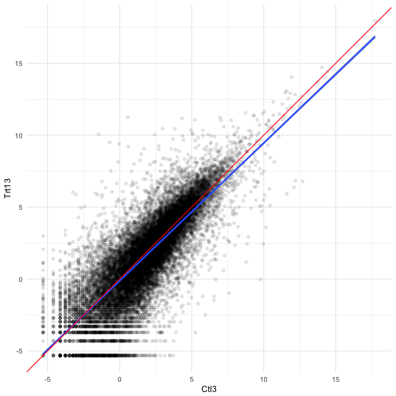


## MDS: edgeR and limma

The same plot, but using far fewer features:


```r
plotMDS(EM, top = 10)
```


# Supervised projections

## Aim

So far we have look at unsupervised projections: We have not taken anything known about the samples into account.

Another approach is supervised projections, where we try to create a low-dimensional representation that best captures differences between our known groups.

A popular methods for this is Linear Discriminant Analysis (LDA). Unfortunately, LDA runs into problems with genomics data due to high multi-colinearity of variables.

limma has a version of LDA for high-dimensional data that implements a few tricks to get around this issue. Again, this method uses only a subset of top genes.

It should be noted though, that supervised projections almost always produce nicely looking plots (due to the high number of input features). That means they should be interpretated with extra caution!

## LDA in limma

We will get back to what many of these settings mean!

```r
plotRLDF(EM, nprobes = 100, labels.y = zebrafish$Design$gallein, trend = TRUE, 
    robust = TRUE)
```

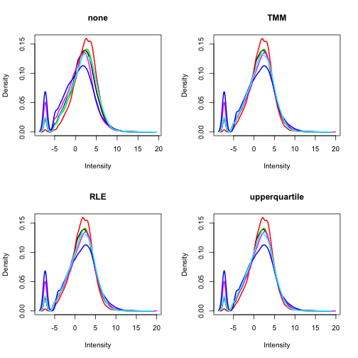

## PLSDA

For those interested, another (more general, but much slower) alternative to LDA for genomics data is Partial Least Squares Discriminant Analysis (PLSDA):


```r
# Perfrom PLSDA
plsda <- DiscriMiner::plsDA(variables = scale(t(EM)), group = zebrafish$Design$gallein, 
    autosel = FALSE, comps = 2)

# Lots of output, we are interested in the components
summary(plsda)
```

```
##                Length Class  Mode   
## functions      39538  -none- numeric
## confusion          4  table  numeric
## scores            12  -none- numeric
## loadings       39536  -none- numeric
## y.loadings         4  -none- numeric
## classification     6  factor numeric
## error_rate         1  -none- numeric
## components        12  -none- numeric
## Q2                 6  -none- numeric
## R2                 8  -none- numeric
## VIP            59304  -none- numeric
## comp_vars      39536  -none- numeric
## comp_group         4  -none- numeric
## specs              6  -none- list
```

## PLSDA

```r
qplot(data=as.data.frame(plsda$components), x=t1, y=t2, geom=c("text"), 
			color=zebrafish$Design$gallein, label=rownames(zebrafish$Design))
```

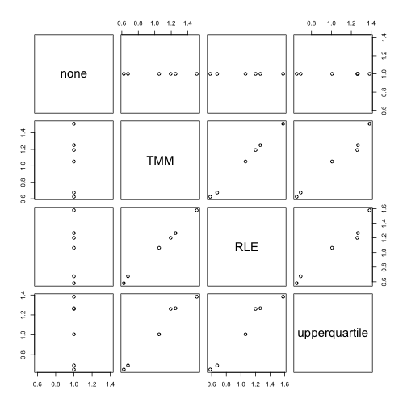

## Exercise

Your exercise now is to perform EDA on the other datasets in `ABC2017`:

```r
data(pasilla)
```

Try to have a look at:

- Normalization
- Run PCA and MDS: Do they look similar?
- Run LDA: How does this look compared to the unsupervised methods:

If you are super quick, you can also have a look at a much more complex dataset:

```r
data(tissues)
```

Can you spot some issues with this dataset?

The next couple of slides have some possible solutions.

# Cheat Sheet

## Pasilla dataset: Normalization

Trim and normalize

```r
# Trim
above_one <- rowSums(pasilla$Expression > 1)
trimmed_em <- subset(pasilla$Expression, above_one > 3)

# Normalize
dge <- DGEList(trimmed_em)
dge <- calcNormFactors(object=dge, method="TMM")
EM <- cpm(x=dge, log=TRUE)
```

## Pasilla dataset: Normalization

Inspect normalization:

```r
plotDensities(EM)
```

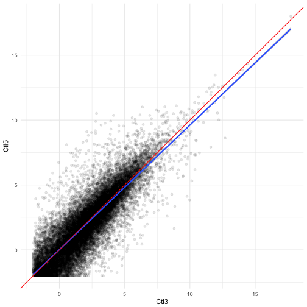

## Pasilla dataset: PCA

PCA on all genes

```r
# Perfrom PCA
pca <- prcomp(x=t(EM), scale=TRUE, center=TRUE)

# Save data for plotting
P <- data.frame(pasilla$Design, pca$x)

# Inspect components
summary(pca)
```

```
## Importance of components%s:
##                            PC1     PC2     PC3     PC4      PC5      PC6
## Standard deviation     50.4068 47.8476 40.5815 32.1250 28.27049 27.23368
## Proportion of Variance  0.2808  0.2530  0.1820  0.1140  0.08831  0.08195
## Cumulative Proportion   0.2808  0.5337  0.7157  0.8297  0.91805  1.00000
##                             PC7
## Standard deviation     1.72e-13
## Proportion of Variance 0.00e+00
## Cumulative Proportion  1.00e+00
```

## Pasilla dataset: PCA


```r
qplot(data=P, x=PC1, y=PC2, geom=c("text"), 
			color=type, label=rownames(P))
```

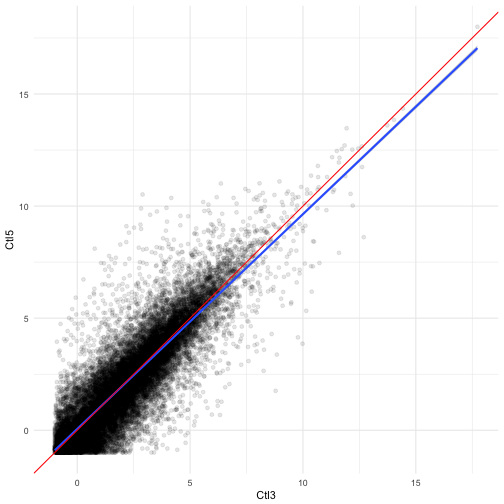

## Pasilla dataset: PCA


```r
qplot(data=P, x=PC1, y=PC2, geom=c("text"), 
			color=condition, label=rownames(P))
```


## Pasilla dataset: MDS

MDS using only a few genes

```r
# Perform MDS, but only save output
mds <-plotMDS(EM, top=100, gene.selection="common", plot=FALSE)

# Save as a data.frame
P <- data.frame(pasilla$Design, mds$cmdscale.out)
```

## Pasilla dataset: MDS


```r
qplot(data=P, x=X1, y=X2, geom=c("text"), 
			color=type, label=rownames(P))
```


## Pasilla dataset: MDS


```r
qplot(data=P, x=X1, y=X2, geom=c("text"), 
			color=condition, label=rownames(P))
```


## Pasilla dataset: LDA

Supervised projection:

```r
# LDF with only 100 genes
ldf <- plotRLDF(EM, nprobes = 100, labels.y = pasilla$Design$condition, trend = TRUE, 
    robust = TRUE, plot = FALSE)

# Save as a data.frame
P <- data.frame(pasilla$Design, ldf$training)
```

## Pasilla dataset: LDA


```r
qplot(data=P, x=X1, y=X2, geom=c("text"), 
			color=type, label=rownames(P))
```


## Pasilla dataset: LDA


```r
qplot(data=P, x=X1, y=X2, geom=c("text"), 
			color=condition, label=rownames(P))
```


## Tissues dataset: Normalization

Trim and normalize

```r
# Trim
above_one <- rowSums(tissues$Expression > 2)
trimmed_em <- subset(tissues$Expression, above_one > 3)

# Normalize
dge <- DGEList(trimmed_em)
dge <- calcNormFactors(object=dge, method="TMM")
EM <- cpm(x=dge, log=TRUE)
```

## Tissues dataset: Normalization

Inspect normalization:

```r
plotDensities(EM, legend = FALSE)
```


## Tissues dataset: PCA

PCA on all genes

```r
# Perfrom PCA
pca <- prcomp(x=t(EM), scale=TRUE, center=TRUE)

# Save data for plotting
P <- data.frame(tissues$Design, pca$x)

# Inspect components
summary(pca)
```

```
## Importance of components%s:
##                            PC1     PC2     PC3      PC4      PC5      PC6
## Standard deviation     48.1546 39.3606 35.8160 33.21002 30.08419 26.43208
## Proportion of Variance  0.1932  0.1291  0.1069  0.09191  0.07542  0.05822
## Cumulative Proportion   0.1932  0.3223  0.4292  0.52115  0.59657  0.65479
##                             PC7      PC8      PC9     PC10     PC11
## Standard deviation     24.16324 22.82369 21.96515 21.49747 20.67478
## Proportion of Variance  0.04866  0.04341  0.04021  0.03851  0.03562
## Cumulative Proportion   0.70345  0.74686  0.78707  0.82558  0.86120
##                            PC12     PC13     PC14     PC15     PC16
## Standard deviation     18.69108 17.27473 17.16618 16.16939 15.70819
## Proportion of Variance  0.02911  0.02487  0.02456  0.02179  0.02056
## Cumulative Proportion   0.89031  0.91518  0.93973  0.96152  0.98208
##                            PC17    PC18      PC19
## Standard deviation     13.93784 4.55212 7.718e-14
## Proportion of Variance  0.01619 0.00173 0.000e+00
## Cumulative Proportion   0.99827 1.00000 1.000e+00
```

## Tissues dataset: PCA


```r
qplot(data=P, x=PC1, y=PC2, geom="text", 
			color=gender, label=tissue.type)
```


