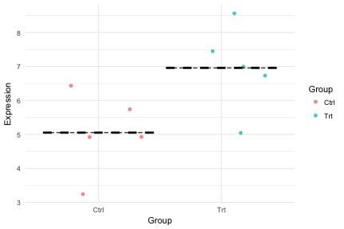
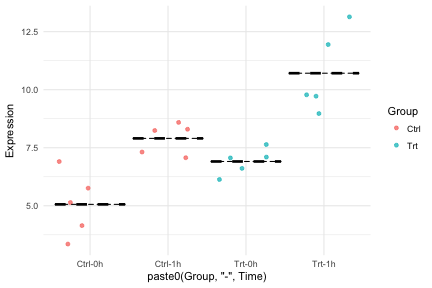
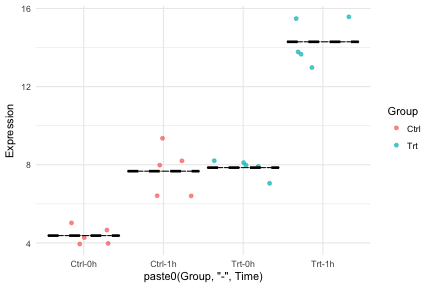
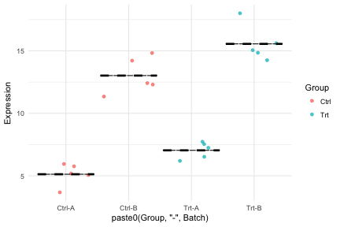
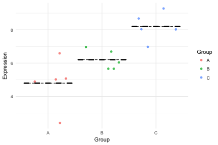

## Introduction

This presentations cover some basic intutions about linear models of gene expression.

We will go through how lm() works, focusing on the specification of design or model matrices for some common designs for expression of a single gene.

Then we will look at linear models for multiple genes using limma.


```r
library(ABC2017)
library(ggplot2)
theme_set(theme_minimal())
data("lmExamples")
names(lmExamples)
```

```
## [1] "twoGroup1"    "twoGroup2"    "interaction1" "interaction2"
## [5] "batchEffect"  "threeGroup"
```

# Linear models of a single gene

## A simple example

Let's consider the first and simplest dataset:


```r
lmExamples$twoGroup1
```

```
##    Group Expression
## 1   Ctrl   6.434201
## 2   Ctrl   4.922708
## 3   Ctrl   5.739137
## 4   Ctrl   3.241395
## 5   Ctrl   4.930175
## 6    Trt   7.451906
## 7    Trt   5.041634
## 8    Trt   6.998476
## 9    Trt   6.734664
## 10   Trt   8.563223
```

## A simple example

Let's plot the two groups:


```r
ggplot(lmExamples$twoGroup1, aes(x=Group, y=Expression, color=Group)) +
	geom_jitter(alpha=0.75) +
	stat_summary(fun.y="mean", fun.ymax="mean", fun.ymin="mean",
							 geom="crossbar", color="black", alpha=0.5, linetype="dashed")
```



## A simple example

We might compare the means using a t-test:


```r
t.test(Expression~Group, data=lmExamples$twoGroup1)
```

```
## 
## 	Welch Two Sample t-test
## 
## data:  Expression by Group
## t = -2.4347, df = 7.9614, p-value = 0.04104
## alternative hypothesis: true difference in means is not equal to 0
## 95 percent confidence interval:
##  -3.70976644 -0.09914742
## sample estimates:
## mean in group Ctrl  mean in group Trt 
##           5.053523           6.957980
```

## A simple example

In this simple example, lm() is identical to the t-test, since they are both based on minimizing the residual sum of squares (RSS):


```r
summary(lm(Expression~Group, data=lmExamples$twoGroup1))
```

```
## 
## Call:
## lm(formula = Expression ~ Group, data = lmExamples$twoGroup1)
## 
## Residuals:
##      Min       1Q   Median       3Q      Max 
## -1.91635 -0.20019 -0.04143  0.63769  1.60524 
## 
## Coefficients:
##             Estimate Std. Error t value Pr(>|t|)    
## (Intercept)   5.0535     0.5531   9.137 1.66e-05 ***
## GroupTrt      1.9045     0.7822   2.435   0.0409 *  
## ---
## Signif. codes:  0 '***' 0.001 '**' 0.01 '*' 0.05 '.' 0.1 ' ' 1
## 
## Residual standard error: 1.237 on 8 degrees of freedom
## Multiple R-squared:  0.4256,	Adjusted R-squared:  0.3538 
## F-statistic: 5.928 on 1 and 8 DF,  p-value: 0.0409
```

What is the meaning of the coefficients?

## A simple example

`lm()` models the data as :

$$ Y_i = \beta_0 + \beta_1 X_i + \varepsilon_i, i=1,\dots,n $$
This can be expressed using linear algebra terms as:

$$ \mathbf{Y}=\mathbf{X}\boldsymbol{\beta}+\boldsymbol{\varepsilon} $$

`lm()` calculate the coefficients in Beta using Ordinary Least Squares (OLS):

First `lm()` build a design (or model) matrix, which is a presence-absence matrix of effects.


```r
mod <- model.matrix(~Group, data=lmExamples$twoGroup1)
```

## A simple example


```r
mod
```

```
##    (Intercept) GroupTrt
## 1            1        0
## 2            1        0
## 3            1        0
## 4            1        0
## 5            1        0
## 6            1        1
## 7            1        1
## 8            1        1
## 9            1        1
## 10           1        1
## attr(,"assign")
## [1] 0 1
## attr(,"contrasts")
## attr(,"contrasts")$Group
## [1] "contr.treatment"
```

## A simple example

Then `lm()` obtains OLS coefficients using: $$ \hat{\boldsymbol{\beta}} = (\mathbf{X}^\top \mathbf{X})^{-1} \mathbf{X}^\top \mathbf{Y} $$


```r
solve(t(mod) %*% mod) %*% t(mod) %*% lmExamples$twoGroup1$Expression
```

```
##                 [,1]
## (Intercept) 5.053523
## GroupTrt    1.904457
```

See your favourite statistics text book for a proof of this!

Note: Actually `lm()` uses something called QR-decomposition for numeric stability, but the idea is the same.

## A simple example

`lm()` calculate p-values based on the assumption that noise is normally distributed.

In the previous example the difference was signficant. In the second examples it is not!

```r
summary(lm(Expression~Group, data=lmExamples$twoGroup2))
```

```
## 
## Call:
## lm(formula = Expression ~ Group, data = lmExamples$twoGroup2)
## 
## Residuals:
##      Min       1Q   Median       3Q      Max 
## -1.43941 -0.87978 -0.08958  0.98318  1.56350 
## 
## Coefficients:
##             Estimate Std. Error t value Pr(>|t|)    
## (Intercept)  5.00892    0.52004   9.632 1.12e-05 ***
## GroupTrt    -0.01412    0.73545  -0.019    0.985    
## ---
## Signif. codes:  0 '***' 0.001 '**' 0.01 '*' 0.05 '.' 0.1 ' ' 1
## 
## Residual standard error: 1.163 on 8 degrees of freedom
## Multiple R-squared:  4.605e-05,	Adjusted R-squared:  -0.1249 
## F-statistic: 0.0003684 on 1 and 8 DF,  p-value: 0.9852
```

## A simple example


```r
ggplot(lmExamples$twoGroup2, aes(x=Group, y=Expression, color=Group)) +
	geom_jitter(alpha=0.75) +
	stat_summary(fun.y="mean", fun.ymax="mean", fun.ymin="mean",
							 geom="crossbar", color="black", alpha=0.5, linetype="dashed")
```


## Interaction design

The power of `lm()` over `t.test()` lies in the fact that `lm()` can estimate means in much more complicated models, where we have more than two means to estimate!

Consider for example a classic interaction experiment:


```r
lmExamples$interaction1
```

```
##    Group Time Expression
## 1   Ctrl   0h   5.140709
## 2   Ctrl   0h   4.147767
## 3   Ctrl   0h   6.903397
## 4   Ctrl   0h   3.351814
## 5   Ctrl   0h   5.759625
## 6    Trt   0h   7.062291
## 7    Trt   0h   6.610969
## 8    Trt   0h   7.636666
## 9    Trt   0h   6.132215
## 10   Trt   0h   7.098734
## 11  Ctrl   1h   7.316826
## 12  Ctrl   1h   8.241089
## 13  Ctrl   1h   8.589432
## 14  Ctrl   1h   7.069375
## 15  Ctrl   1h   8.297462
## 16   Trt   1h  13.137277
## 17   Trt   1h   8.972465
## 18   Trt   1h  11.941803
## 19   Trt   1h   9.722044
## 20   Trt   1h   9.778411
```

## Interaction design


```r
ggplot(lmExamples$interaction1, aes(x=paste0(Group, "-", Time), y=Expression, color=Group)) +
	geom_jitter(alpha=0.75) +
	stat_summary(fun.y="mean", fun.ymax="mean", fun.ymin="mean",
							 geom="crossbar", color="black", alpha=0.5, linetype="dashed")
```



## Interaction design


```r
summary(lm(Expression~Group*Time, data=lmExamples$interaction1))
```

```
## 
## Call:
## lm(formula = Expression ~ Group * Time, data = lmExamples$interaction1)
## 
## Residuals:
##     Min      1Q  Median      3Q     Max 
## -1.7379 -0.8533  0.1171  0.6897  2.4269 
## 
## Coefficients:
##                 Estimate Std. Error t value Pr(>|t|)    
## (Intercept)       5.0607     0.5359   9.443 6.06e-08 ***
## GroupTrt          1.8475     0.7579   2.438  0.02683 *  
## Time1h            2.8422     0.7579   3.750  0.00175 ** 
## GroupTrt:Time1h   0.9601     1.0718   0.896  0.38369    
## ---
## Signif. codes:  0 '***' 0.001 '**' 0.01 '*' 0.05 '.' 0.1 ' ' 1
## 
## Residual standard error: 1.198 on 16 degrees of freedom
## Multiple R-squared:  0.7841,	Adjusted R-squared:  0.7436 
## F-statistic: 19.36 on 3 and 16 DF,  p-value: 1.419e-05
```

Is the interaction significant?

## Interaction design


```r
model.matrix(Expression~Group*Time, data=lmExamples$interaction1)
```

```
##    (Intercept) GroupTrt Time1h GroupTrt:Time1h
## 1            1        0      0               0
## 2            1        0      0               0
## 3            1        0      0               0
## 4            1        0      0               0
## 5            1        0      0               0
## 6            1        1      0               0
## 7            1        1      0               0
## 8            1        1      0               0
## 9            1        1      0               0
## 10           1        1      0               0
## 11           1        0      1               0
## 12           1        0      1               0
## 13           1        0      1               0
## 14           1        0      1               0
## 15           1        0      1               0
## 16           1        1      1               1
## 17           1        1      1               1
## 18           1        1      1               1
## 19           1        1      1               1
## 20           1        1      1               1
## attr(,"assign")
## [1] 0 1 2 3
## attr(,"contrasts")
## attr(,"contrasts")$Group
## [1] "contr.treatment"
## 
## attr(,"contrasts")$Time
## [1] "contr.treatment"
```

## Interaction design


```r
model.matrix(Expression~Group+Time+Group:Time, data=lmExamples$interaction1)
```

```
##    (Intercept) GroupTrt Time1h GroupTrt:Time1h
## 1            1        0      0               0
## 2            1        0      0               0
## 3            1        0      0               0
## 4            1        0      0               0
## 5            1        0      0               0
## 6            1        1      0               0
## 7            1        1      0               0
## 8            1        1      0               0
## 9            1        1      0               0
## 10           1        1      0               0
## 11           1        0      1               0
## 12           1        0      1               0
## 13           1        0      1               0
## 14           1        0      1               0
## 15           1        0      1               0
## 16           1        1      1               1
## 17           1        1      1               1
## 18           1        1      1               1
## 19           1        1      1               1
## 20           1        1      1               1
## attr(,"assign")
## [1] 0 1 2 3
## attr(,"contrasts")
## attr(,"contrasts")$Group
## [1] "contr.treatment"
## 
## attr(,"contrasts")$Time
## [1] "contr.treatment"
```

## Interaction design


```r
ggplot(lmExamples$interaction2, aes(x=paste0(Group, "-", Time), y=Expression, color=Group)) +
	geom_jitter(alpha=0.75) +
	stat_summary(fun.y="mean", fun.ymax="mean", fun.ymin="mean",
							 geom="crossbar", color="black", alpha=0.5, linetype="dashed")
```



## Interaction design


```r
summary(lm(Expression~Group*Time, data=lmExamples$interaction2))
```

```
## 
## Call:
## lm(formula = Expression ~ Group * Time, data = lmExamples$interaction2)
## 
## Residuals:
##      Min       1Q   Median       3Q      Max 
## -1.31870 -0.54550  0.09752  0.39616  1.68685 
## 
## Coefficients:
##                 Estimate Std. Error t value Pr(>|t|)    
## (Intercept)       4.3739     0.4119  10.619 1.18e-08 ***
## GroupTrt          3.4798     0.5825   5.974 1.95e-05 ***
## Time1h            3.2974     0.5825   5.661 3.54e-05 ***
## GroupTrt:Time1h   3.1422     0.8238   3.814  0.00153 ** 
## ---
## Signif. codes:  0 '***' 0.001 '**' 0.01 '*' 0.05 '.' 0.1 ' ' 1
## 
## Residual standard error: 0.921 on 16 degrees of freedom
## Multiple R-squared:  0.9501,	Adjusted R-squared:  0.9407 
## F-statistic: 101.5 on 3 and 16 DF,  p-value: 1.255e-10
```

Is the interaction significant?

## Batch correction

Another common case is blocking or correcting for batches:


```r
lmExamples$batchEffect
```

```
##    Group Batch Expression
## 1   Ctrl     A   5.768634
## 2   Ctrl     A   5.186895
## 3   Ctrl     A   3.669391
## 4   Ctrl     A   5.063698
## 5   Ctrl     A   5.942941
## 6    Trt     A   7.239568
## 7    Trt     A   6.516735
## 8    Trt     A   7.525216
## 9    Trt     A   7.729125
## 10   Trt     A   6.180639
## 11  Ctrl     B  14.209668
## 12  Ctrl     B  12.307729
## 13  Ctrl     B  12.412651
## 14  Ctrl     B  11.348493
## 15  Ctrl     B  14.821562
## 16   Trt     B  18.010870
## 17   Trt     B  14.243523
## 18   Trt     B  14.848536
## 19   Trt     B  15.616746
## 20   Trt     B  15.062057
```

## Batch correction


```r
ggplot(lmExamples$batchEffect, aes(x=paste0(Group, "-", Batch), y=Expression, color=Group)) +
	geom_jitter(alpha=0.75) +
	stat_summary(fun.y="mean", fun.ymax="mean", fun.ymin="mean",
							 geom="crossbar", color="black", alpha=0.5, linetype="dashed")
```



## Batch correction

Without modelling batch:

```r
summary(lm(Expression~Group, data=lmExamples$batchEffect))
```

```
## 
## Call:
## lm(formula = Expression ~ Group, data = lmExamples$batchEffect)
## 
## Residuals:
##     Min      1Q  Median      3Q     Max 
## -5.4038 -3.9171 -0.4274  3.6046  6.7136 
## 
## Coefficients:
##             Estimate Std. Error t value Pr(>|t|)    
## (Intercept)    9.073      1.412   6.425 4.78e-06 ***
## GroupTrt       2.224      1.997   1.114     0.28    
## ---
## Signif. codes:  0 '***' 0.001 '**' 0.01 '*' 0.05 '.' 0.1 ' ' 1
## 
## Residual standard error: 4.466 on 18 degrees of freedom
## Multiple R-squared:  0.06446,	Adjusted R-squared:  0.01249 
## F-statistic:  1.24 on 1 and 18 DF,  p-value: 0.2801
```

## Batch correction

With modelling batch:

```r
summary(lm(Expression~Group+Batch, data=lmExamples$batchEffect))
```

```
## 
## Call:
## lm(formula = Expression ~ Group + Batch, data = lmExamples$batchEffect)
## 
## Residuals:
##      Min       1Q   Median       3Q      Max 
## -1.82762 -0.78970  0.06935  0.60068  2.61062 
## 
## Coefficients:
##             Estimate Std. Error t value Pr(>|t|)    
## (Intercept)   4.9702     0.4435  11.208 2.84e-09 ***
## GroupTrt      2.2241     0.5121   4.343 0.000442 ***
## BatchB        8.2059     0.5121  16.025 1.08e-11 ***
## ---
## Signif. codes:  0 '***' 0.001 '**' 0.01 '*' 0.05 '.' 0.1 ' ' 1
## 
## Residual standard error: 1.145 on 17 degrees of freedom
## Multiple R-squared:  0.9419,	Adjusted R-squared:  0.9351 
## F-statistic: 137.8 on 2 and 17 DF,  p-value: 3.123e-11
```

## Batch correction


```r
model.matrix(~Group+Batch, data=lmExamples$batchEffect)
```

```
##    (Intercept) GroupTrt BatchB
## 1            1        0      0
## 2            1        0      0
## 3            1        0      0
## 4            1        0      0
## 5            1        0      0
## 6            1        1      0
## 7            1        1      0
## 8            1        1      0
## 9            1        1      0
## 10           1        1      0
## 11           1        0      1
## 12           1        0      1
## 13           1        0      1
## 14           1        0      1
## 15           1        0      1
## 16           1        1      1
## 17           1        1      1
## 18           1        1      1
## 19           1        1      1
## 20           1        1      1
## attr(,"assign")
## [1] 0 1 2
## attr(,"contrasts")
## attr(,"contrasts")$Group
## [1] "contr.treatment"
## 
## attr(,"contrasts")$Batch
## [1] "contr.treatment"
```

## Three Groups

As you can see, you can specify any complex design! For example a three group design:


```r
summary(lm(Expression~Group, data=lmExamples$threeGroup))
```

```
## 
## Call:
## lm(formula = Expression ~ Group, data = lmExamples$threeGroup)
## 
## Residuals:
##      Min       1Q   Median       3Q      Max 
## -2.38932 -0.35826  0.09675  0.48379  1.78904 
## 
## Coefficients:
##             Estimate Std. Error t value Pr(>|t|)    
## (Intercept)   4.7963     0.4732  10.136 3.09e-07 ***
## GroupB        1.4072     0.6692   2.103 0.057249 .  
## GroupC        3.4016     0.6692   5.083 0.000269 ***
## ---
## Signif. codes:  0 '***' 0.001 '**' 0.01 '*' 0.05 '.' 0.1 ' ' 1
## 
## Residual standard error: 1.058 on 12 degrees of freedom
## Multiple R-squared:  0.685,	Adjusted R-squared:  0.6325 
## F-statistic: 13.05 on 2 and 12 DF,  p-value: 0.0009767
```

How does the model matrix look?

## Three groups


```r
ggplot(lmExamples$threeGroup, aes(x=Group, y=Expression, color=Group)) +
	geom_jitter(alpha=0.75) +
	stat_summary(fun.y="mean", fun.ymax="mean", fun.ymin="mean",
							 geom="crossbar", color="black", alpha=0.5, linetype="dashed")
```



## Going further

The R formula interface is almost a programming language in itself!

Due to it's expressiveness, it's used by huge number of packages, making it well worth the effort to learn.

See this cheatsheet for an overview:

https://ww2.coastal.edu/kingw/statistics/R-tutorials/formulae.html

By default, the first alphabetical category is chosen as the Intercept. If you do not want this, you can use the `relevel` function to specify the reference level of the factor.

This "memory" of a factor to store it's reference level is why insists on coercing characters to factors!

# Linear models of multiple genes

## Introduction

Now we have seen how linear models can be used a analyse the expression of a single gene.

In a genomic setting, we wish to analyze the expression of all genes. This means that we are applying the same model many times to each individual genes.

Given the low sample size of most genomics experiments, each linear model has relatively low power to detect differential expression.

We can get around this problem by assuming all models are somehow similar, and share information between them, i.e. share information between genes.

Here we show the simplest implementation of this using limma-trend.


```r
library(limma)
library(edgeR)
data("zebrafish")
```

## Normalizing the EM

Like previosly, we first generate normalize and log-transform the EM:


```r
# Trim
above_one <- rowSums(zebrafish$Expression > 1)
trimmed_em <- subset(zebrafish$Expression, above_one > 3)

# Normalize
dge <- DGEList(trimmed_em)
dge <- calcNormFactors(object=dge, method="TMM")
EM <- cpm(x=dge, log=TRUE)
```

## Setting up the model matrix.

We then set up of simple design matrix

```r
mod <- model.matrix(~gallein, data=zebrafish$Design)
mod
```

```
##       (Intercept) galleintreated
## Ctl1            1              0
## Ctl3            1              0
## Ctl5            1              0
## Trt9            1              1
## Trt11           1              1
## Trt13           1              1
## attr(,"assign")
## [1] 0 1
## attr(,"contrasts")
## attr(,"contrasts")$gallein
## [1] "contr.treatment"
```

## Gene-wise linear models

We then use limma to fit gene-wise linear models

```r
fit <- lmFit(EM, design=mod)
fit
```

```
## An object of class "MArrayLM"
## $coefficients
##                    (Intercept) galleintreated
## ENSDARG00000000001    2.272323    -0.47696662
## ENSDARG00000000002    3.456550    -0.15052046
## ENSDARG00000000018    2.466735     1.70100849
## ENSDARG00000000019    6.555879     1.16801394
## ENSDARG00000000068    1.156909     0.04759501
## 19763 more rows ...
## 
## $rank
## [1] 2
## 
## $assign
## [1] 0 1
## 
## $qr
## $qr
##       (Intercept) galleintreated
## Ctl1   -2.4494897     -1.2247449
## Ctl3    0.4082483      1.2247449
## Ctl5    0.4082483      0.2898979
## Trt9    0.4082483     -0.5265986
## Trt11   0.4082483     -0.5265986
## Trt13   0.4082483     -0.5265986
## attr(,"assign")
## [1] 0 1
## attr(,"contrasts")
## attr(,"contrasts")$gallein
## [1] "contr.treatment"
## 
## 
## $qraux
## [1] 1.408248 1.289898
## 
## $pivot
## [1] 1 2
## 
## $tol
## [1] 1e-07
## 
## $rank
## [1] 2
## 
## 
## $df.residual
## [1] 4 4 4 4 4
## 19763 more elements ...
## 
## $sigma
## ENSDARG00000000001 ENSDARG00000000002 ENSDARG00000000018 
##          1.7422533          1.2439286          0.5141399 
## ENSDARG00000000019 ENSDARG00000000068 
##          0.9388470          1.2334999 
## 19763 more elements ...
## 
## $cov.coefficients
##                (Intercept) galleintreated
## (Intercept)      0.3333333     -0.3333333
## galleintreated  -0.3333333      0.6666667
## 
## $stdev.unscaled
##                    (Intercept) galleintreated
## ENSDARG00000000001   0.5773503      0.8164966
## ENSDARG00000000002   0.5773503      0.8164966
## ENSDARG00000000018   0.5773503      0.8164966
## ENSDARG00000000019   0.5773503      0.8164966
## ENSDARG00000000068   0.5773503      0.8164966
## 19763 more rows ...
## 
## $pivot
## [1] 1 2
## 
## $Amean
## ENSDARG00000000001 ENSDARG00000000002 ENSDARG00000000018 
##           2.033839           3.381290           3.317239 
## ENSDARG00000000019 ENSDARG00000000068 
##           7.139886           1.180707 
## 19763 more elements ...
## 
## $method
## [1] "ls"
## 
## $design
##       (Intercept) galleintreated
## Ctl1            1              0
## Ctl3            1              0
## Ctl5            1              0
## Trt9            1              1
## Trt11           1              1
## Trt13           1              1
## attr(,"assign")
## [1] 0 1
## attr(,"contrasts")
## attr(,"contrasts")$gallein
## [1] "contr.treatment"
```

## Empirical Bayes

Limma uses empirical bayes to _shrink_ t-statistics of genes toward the overall trend:

```r
eb <- eBayes(fit, trend=TRUE, robust=TRUE)
plotSA(eb)
```


## Empirical Bayes

We can see how the shrinage is working, by comparing the shrunken to the unshrunken t-statistics:


```r
tstat <- data.frame(raw=(fit$coef/fit$stdev.unscaled/fit$sigma)[,"galleintreated"],
										shrunken=eb$t[,"galleintreated"])
```

## Empirical Bayes


```r
ggplot(tstat, aes(x=raw, y=shrunken, color=raw-shrunken)) + 
	geom_point(alpha=0.33) +
	scale_color_distiller(palette = "Spectral") +
	geom_abline(linetype="dashed", alpha=0.75)
```


