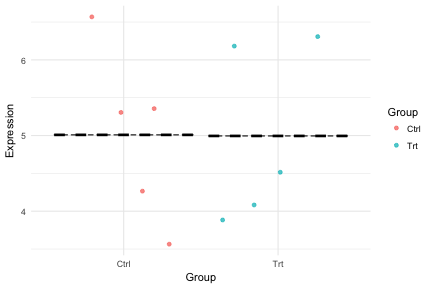
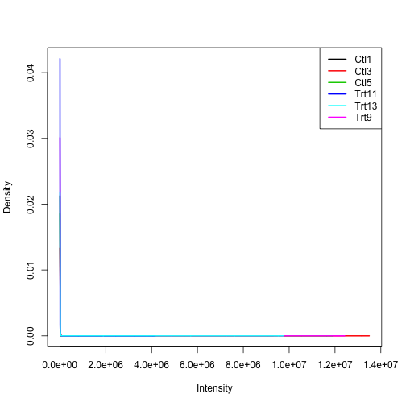

## Introduction

This presentation will show the basic usage of edgeR:

- Normalization.
- Dispersion estimate.
- Fitting GLMs.
- Testing coefficients and contrasts.
- Testing the results.


```r
# Load the data
library(ABC2017)
library(ggplot2)
theme_set(theme_minimal())
library(edgeR)
data("zebrafish")
```

## Trimming and normalizing the data.

Just as before, we started by loading, trimming and normalizing the data:


```r
# Trim 
EM_zebra <- subset(zebrafish$Expression, rowSums(zebrafish$Expression >= 5) >= 3)

# Calculate normalization factors
dge_zebra <- DGEList(EM_zebra)
dge_zebra <- calcNormFactors(dge_zebra, method="TMM")
```

## Building the model matrix

We use `model.matrix` to make a simple model matrix:


```r
mod <- model.matrix(~gallein, data=zebrafish$Design)
mod
```

```
##       (Intercept) galleintreated
## Ctl1            1              0
## Ctl3            1              0
## Ctl5            1              0
## Trt9            1              1
## Trt11           1              1
## Trt13           1              1
## attr(,"assign")
## [1] 0 1
## attr(,"contrasts")
## attr(,"contrasts")$gallein
## [1] "contr.treatment"
```

## Estimating the dispersion

Now we move on to estimating dispersion or BCV:


```r
disp_zebra <- estimateDisp(dge_zebra, design=mod, robust=TRUE)
```

The 3-step estimation is all done by a single function in the newest version of edgeR: `estimateDisp`, which replaces the three previous functions of 

- `estimateCommonDisp`
- `estimateTrendedDisp`
- `estimateTagwiseDisp`

## Plotting the dispersion

We can then plot the estimates:

```r
plotBCV(y=disp_zebra)
```


## Fiting gene-wise GLMs and testing a coefficient.

Now we can fit gene-wise GLMs:


```r
fit_zebra <- glmFit(disp_zebra, design=mod)
```

Finally, we can test a coefficient in the model for DE:


```r
# Using the name of the coefficient
gallein <- glmLRT(fit_zebra, coef="galleintreated")

# Using the index of the coefficient
gallein <- glmLRT(fit_zebra, coef=2)
```

## Inspecting the results

edgeR has several useful functions for inspecting and plotting the results:

Inspecting the top hits with `topTags`:


```r
topTags(gallein)
```

```
## Coefficient:  galleintreated 
##                        logFC      logCPM       LR       PValue        FDR
## ENSDARG00000075505 -7.050266  0.91117648 23.80888 1.063907e-06 0.02098875
## ENSDARG00000002508 -6.899411  1.98202488 22.20389 2.451759e-06 0.02296418
## ENSDARG00000091349 -8.890033  2.67150109 20.55248 5.801872e-06 0.02296418
## ENSDARG00000069441 -9.167127 -0.06217613 20.49904 5.966113e-06 0.02296418
## ENSDARG00000071565  7.114211  0.34425608 20.11517 7.291619e-06 0.02296418
## ENSDARG00000087178 -9.267206  0.03576790 19.88517 8.223557e-06 0.02296418
## ENSDARG00000040128  7.387525  6.64510937 19.77201 8.725111e-06 0.02296418
## ENSDARG00000090689  5.949190  4.67990013 19.49232 1.010048e-05 0.02296418
## ENSDARG00000000906 -8.272182  1.30746230 19.42254 1.047636e-05 0.02296418
## ENSDARG00000076643 -7.572011  0.42975453 18.64519 1.574441e-05 0.02741095
```

## Inspecting the results

Summarize the number of up- and down-regulated genes with `decideTestsDGE`:


```r
is_de <- decideTestsDGE(gallein, p.value=0.1)
head(is_de)
```

```
##                    galleintreated
## ENSDARG00000000001              0
## ENSDARG00000000002              0
## ENSDARG00000000018              0
## ENSDARG00000000019              0
## ENSDARG00000000068              0
## ENSDARG00000000069              0
```

```r
summary(is_de)
```

```
##    galleintreated
## -1             68
## 0           19581
## 1              79
```

## Inspecting the results

MA-plot, showing relation between mean expression and logFC, :

```r
plotSmear(gallein, de.tags=rownames(gallein)[is_de != 0])
```



## Inspecting the results

There is no built-in function for making a volcano plot, but it's easy to do yourself:

```r
res <- as.data.frame(topTags(gallein, n=Inf, sort.by="none"))
ggplot(res, aes(x=logFC, y=-log10(PValue), color=FDR < 0.05)) + geom_point()
```



## Quasi-likelihood: Fitting models

Recently, edgeR introduced an alternative DE pipeline using Quasi-likelihood. It should be slightly more conservative than the standard edgeR pipeline. Code-wise, though, they are almost identical:


```r
fitQL <- glmQLFit(y=disp_zebra, design=mod, robust=TRUE)
galleinQL <- glmQLFTest(fitQL, coef="galleintreated")
summary(decideTestsDGE(galleinQL, p.value=0.1))
```

```
##    galleintreated
## -1              0
## 0           19728
## 1               0
```

## Quasi-likehood: Plotting dispersions

The QL-pipeline estimates slightly different dispersions:


```r
plotQLDisp(fitQL)
```


## Final exercises:

Use the above code as a template for conducting your own analysis. For the `yeast` and `pasilla` datasets:

- Load, trim and normalize the data
- Inspect the study design, and decide on a model matrix to use with edgeR
- Use edgeR to estimate dispersions and fit gene-wise GLMs
- Report the number of up- and down-regulated genes for the tests of interests
- Generate smear and volcano plots summarizing the analysis.

If you have time:

- Investigate the effect of different normalization methods.
- Try out the QL-pipeline by replacing `glmFit` with `glmQLFit` and `glmLRT` with `glmQLFTest`
- Refering the slides, see if you can also test a contrast by using a contrast-vector of the form: `c(0,0,-1,1)`

Once again - the next couple of slides contain cheat sheets.

## Cheatsheet: Experimenting with model matrices


```r
# Load the data
data("pasilla")

# Set a datasets
dataset <- pasilla

# Experiment with model matrices
mod <- model.matrix(~condition, data=dataset$Design)

# Look how the experiment is designed
dataset$Design
```

```
##              condition        type
## treated1fb     treated single-read
## treated2fb     treated  paired-end
## treated3fb     treated  paired-end
## untreated1fb untreated single-read
## untreated2fb untreated single-read
## untreated3fb untreated  paired-end
## untreated4fb untreated  paired-end
```

## Cheatsheet: Fitting the models


```r
# Trim 
EM <- subset(dataset$Expression, rowSums(dataset$Expression >= 5) >= 3)

# Calculate normalization factors
dge <- calcNormFactors(DGEList(EM), method="TMM")

# Calculate dispersion
disp <- estimateDisp(dge, design=mod, robust=TRUE)

# Fit models
fit <- glmFit(disp, design=mod)

# Perform the test of the given coefficient
res <- glmLRT(fit, coef="conditionuntreated")
```

## Cheatsheet: Inspecting the results


```r
# Dispersion
plotBCV(disp)

# topTages
topTags(res)

# Up and down regulated genes
summary(decideTestsDGE(res))

# Smear plot
plotSmear(res, de.tags=rownames(res)[decideTestsDGE(res) != 0])

# Volcano
all_genes <- as.data.frame(topTags(res, n=Inf, sort.by="none"))
ggplot(all_genes, aes(x=logFC, y=-log10(PValue), color=FDR < 0.05)) + geom_point()
```

